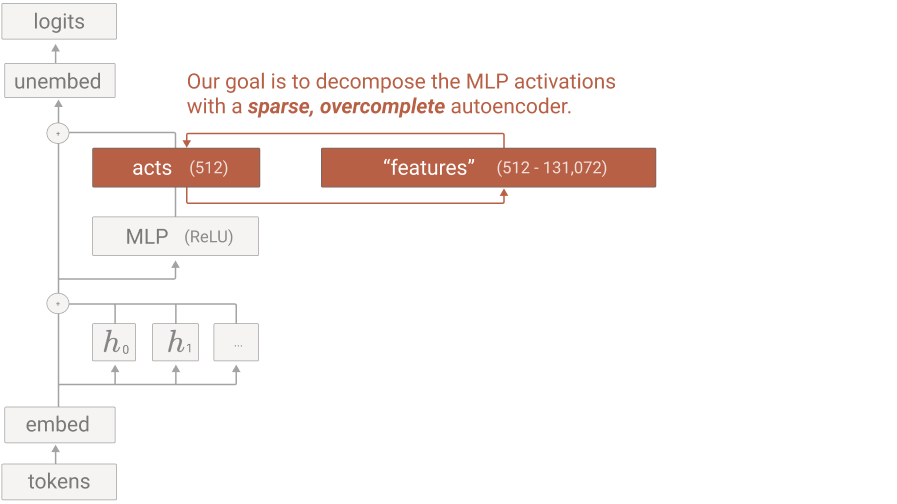

# interpretable-layer-cost
A calculator for estimating the _compute_ cost of building a sparse auto-encoder layer into an LLM to make concepts inside such LLM interpretable. Auto-published at https://huge.github.io/interpretable-layer-cost

## Problem Setup

Neural network activations can be decomposed as:  
**xʲ ≈ b + Σᵢ fᵢ(xʲ)dᵢ**  

Where:  
- **b**: Bias term.  
- **dᵢ**: Feature directions.  
- **fᵢ(xʲ)**: Feature activations, defined as:  
  **fᵢ(x) = ReLU(Wₑ(x - bᵈ) + bₑ)ᵢ**  

This represents a linear matrix factorization of the activation space, with non-linearities capturing complex patterns.  

The **superposition hypothesis** suggests that neural networks leverage sparsity to represent more features than neurons.  

### Sparse Autoencoder Setup  

We employ a **linear encoder with ReLU** and a **linear decoder**, trained with an Adam optimizer, MSE loss, and an L1 penalty for sparsity. Training utilizes 8 billion data points and neuron resampling for coverage.  

This decomposition aims to improve interpretability, enabling targeted input design and deeper understanding of how neural networks process information.

todo: 

2. explain params( like http://transformer-circuits.pub/2023/monosemantic-features/index.html#problem-setup ) and draw the inserted layer struct

3. sketch replication OSS efforts and ideas to be explored/developed on public-weights LLMs

4. instead of the parameter for sheer training samples, maybe a target precision form a scaling law could be set
